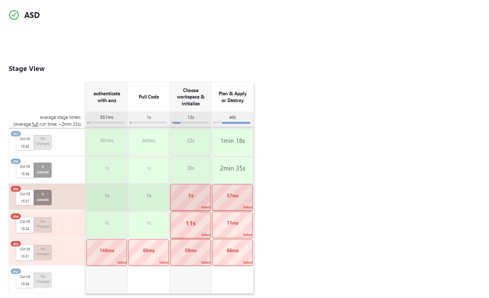
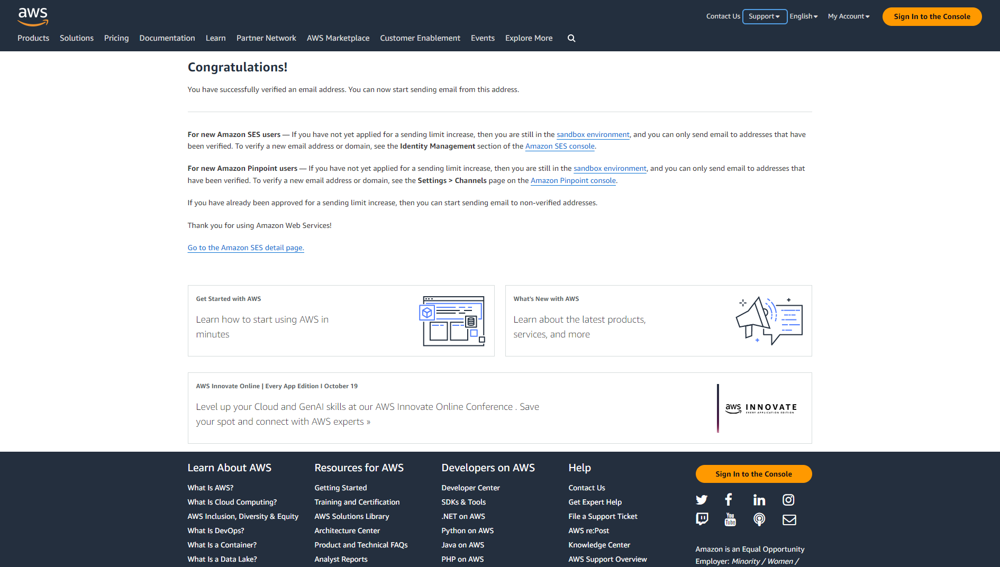
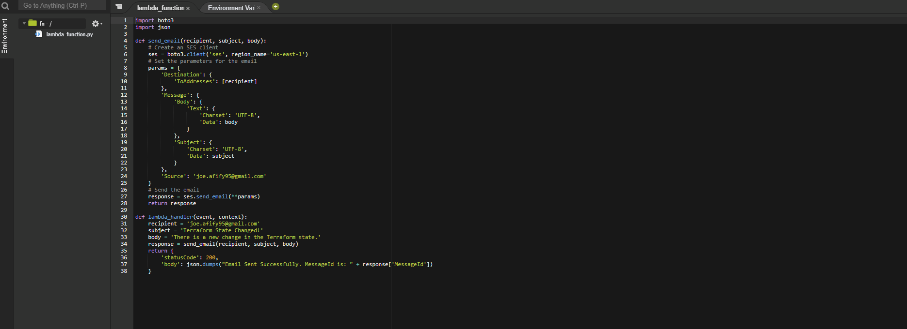
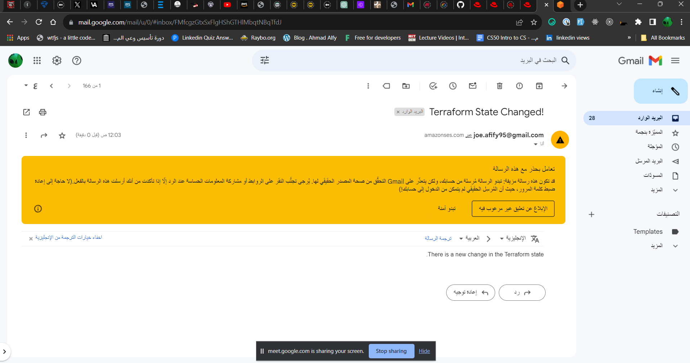

## Create pipeline that takes env-param to apply terraform code on certain env

## Verify your email in SES service

## Create lambda function to send email

## Create trigger to detect changes in state file and send the email

